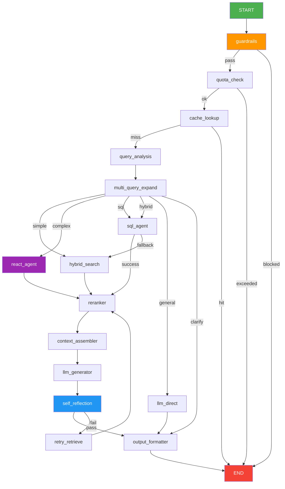

# LangGraph RAG 架構規劃

> 建立日期：2026-03-10
> 依據：`13-multi-agent-architecture.md`、`14-graph-rag-applications.md`、`03-backend-implementation.md`
> 目的：將 NobodyClimb 現有 Cloudflare-native Agentic RAG 系統，規劃為基於 LangGraph (LangChain) 的對等實作，作為框架遷移評估與技術參考

---

## 一、背景與目的

### 1.1 現有架構概覽

NobodyClimb 目前使用**自建 Pipeline Engine**（`backend/src/services/pipeline/`）實作 Gen 4 Agentic RAG，所有元件均運行於 Cloudflare Workers 生態系：

```
現有技術棧：
- 執行環境：Cloudflare Workers (Hono framework)
- LLM：Workers AI (@cf/meta/llama-3.1-8b-instruct)
- Embedding：Workers AI (@cf/baai/bge-m3)
- Reranker：Workers AI (@cf/baai/bge-reranker-base)
- 向量庫：Cloudflare Vectorize
- 資料庫：Cloudflare D1 (SQLite)
- 快取：Cloudflare KV
- 編排：自建 PipelineEngine（14 步驟線性/條件路由）
```

### 1.2 為何規劃 LangGraph 版本

| 動機 | 說明 |
|------|------|
| **框架標準化** | LangGraph 是業界主流 Agent 編排框架，社群生態豐富 |
| **狀態管理** | LangGraph 內建持久化 State，優於 Cloudflare Pipeline 的無狀態設計 |
| **視覺化除錯** | LangGraph Studio 支援圖形化 trace，比 pipeline traces 更直觀 |
| **可擴展性** | 新增節點/邊不影響現有邏輯，比自建 Registry 更靈活 |
| **測試友善** | 每個 Node 可獨立單元測試，更符合工程最佳實踐 |
| **多 Agent 原生支援** | LangGraph 原生支援 Supervisor、Swarm、Plan-Execute 模式 |

### 1.3 規劃範圍

本文件聚焦**後端 RAG 核心邏輯**的 LangGraph 化：
- ✅ Query 解析與意圖分類
- ✅ 多策略檢索（Hybrid Search、HyDE、Multi-Query）
- ✅ Reranking 與後處理
- ✅ Agentic ReAct 迴圈
- ✅ 自我反思（Self-Reflection）與品質評估
- ✅ 回答生成
- ⬜ 前端整合（不在本次規劃範圍）
- ⬜ Cloudflare 基礎設施（假設使用 Node.js 執行環境）

---

## 二、LangGraph 核心概念對應

### 2.1 概念映射表

| 現有概念 | LangGraph 對應 | 說明 |
|---------|---------------|------|
| `PipelineStep` | `Node` | 圖中的執行單元，接收/輸出 State |
| `PipelineEngine` | `StateGraph` | 有向圖，定義節點與邊 |
| `step.condition` | `Conditional Edge` | 根據 State 動態決定下一節點 |
| `step.loopBack` | 回邊（Back Edge）+ `Command` | 實現 ReAct/自我反思迴圈 |
| `QueryTrace` | `AgentState` | 貫穿整個 Graph 的共享狀態 |
| `tool-registry` | `ToolNode` + LangChain Tools | 標準化工具呼叫介面 |
| `pipeline/registry.ts` | Graph 定義（`.addNode()` / `.addEdge()`） | 宣告式圖結構 |
| `agentic ReAct loop` | `ReAct Agent` subgraph | 巢狀子圖 |

### 2.2 Graph 執行模型對比

```
現有 Pipeline（線性 + 條件跳轉）：
  Step1 → Step2 → [if condition] → Step3a / Step3b → ... → StepN

LangGraph（有向圖）：
  Node1 ──▶ Node2 ──▶ conditional_edge ──▶ Node3a
                                        └──▶ Node3b ──▶ Node4
                                                         ↑
                                               (loopback edge)
```

---

## 三、State 設計

### 3.1 主 GraphState

LangGraph 的核心是共享 State，對應現有的 `QueryTrace` 與 `PipelineContext`：

```typescript
import { Annotation, messagesStateReducer } from "@langchain/langgraph";
import { BaseMessage } from "@langchain/core/messages";

// 主 Graph State（對應現有 QueryTrace + PipelineContext）
const GraphState = Annotation.Root({
  // === 輸入 ===
  query: Annotation<string>(),
  userId: Annotation<string | undefined>(),
  sessionId: Annotation<string | undefined>(),
  userContext: Annotation<UserContext | undefined>(),

  // === 對話歷史（LangGraph 原生訊息管理）===
  messages: Annotation<BaseMessage[]>({
    reducer: messagesStateReducer,
    default: () => [],
  }),

  // === 查詢分析結果 ===
  intent: Annotation<QueryIntent | undefined>(),
  // intent: 'simple' | 'complex' | 'sql' | 'hybrid' | 'general-knowledge' | 'clarification-needed'
  metadataFilters: Annotation<MetadataFilter | undefined>(),
  expandedQueries: Annotation<string[]>({
    default: () => [],
  }),
  hydeDocument: Annotation<string | undefined>(),

  // === 快取 ===
  cacheHit: Annotation<boolean>({
    default: () => false,
  }),
  cachedResponse: Annotation<CachedResponse | undefined>(),

  // === 檢索結果 ===
  retrievedDocs: Annotation<RetrievedDoc[]>({
    reducer: (existing, update) => mergeAndDedup(existing, update),
    default: () => [],
  }),
  sqlResults: Annotation<SqlResult | undefined>(),

  // === Reranking 後 ===
  rankedDocs: Annotation<RankedDoc[]>({
    default: () => [],
  }),

  // === ReAct Agent 狀態 ===
  agentScratchpad: Annotation<AgentStep[]>({
    default: () => [],
  }),
  agentIterations: Annotation<number>({
    default: () => 0,
  }),
  maxAgentIterations: Annotation<number>({
    default: () => 5,
  }),

  // === 生成結果 ===
  answer: Annotation<string | undefined>(),
  sources: Annotation<Source[]>({
    default: () => [],
  }),
  suggestedQuestions: Annotation<string[]>({
    default: () => [],
  }),

  // === 品質評估 ===
  groundednessScore: Annotation<number | undefined>(),
  qualityScore: Annotation<number | undefined>(),
  selfReflectionPassed: Annotation<boolean | undefined>(),
  reflectionRetries: Annotation<number>({
    default: () => 0,
  }),

  // === 系統控制 ===
  error: Annotation<string | undefined>(),
  quotaExceeded: Annotation<boolean>({
    default: () => false,
  }),
  guardrailsBlocked: Annotation<boolean>({
    default: () => false,
  }),

  // === 可觀測性 ===
  trace: Annotation<TraceStep[]>({
    reducer: (existing, update) => [...existing, ...update],
    default: () => [],
  }),
  startTime: Annotation<number>(),
  tokensUsed: Annotation<number>({
    default: () => 0,
  }),
});

type GraphStateType = typeof GraphState.State;
```

### 3.2 子 Graph State（ReAct Agent）

```typescript
// ReAct 子圖的 State（繼承部分主 State）
const ReactAgentState = Annotation.Root({
  query: Annotation<string>(),
  retrievedDocs: Annotation<RetrievedDoc[]>({
    default: () => [],
  }),
  scratchpad: Annotation<AgentStep[]>({
    reducer: (existing, update) => [...existing, ...update],
    default: () => [],
  }),
  iterations: Annotation<number>({
    default: () => 0,
  }),
  decision: Annotation<AgentDecision | undefined>(),
  // decision: 'ANSWER' | 'RETRIEVE' | 'BROADEN' | 'SWITCH_TOOL' | 'DECOMPOSE' | 'VERIFY'
  finalDocs: Annotation<RetrievedDoc[]>({
    default: () => [],
  }),
});
```

---

## 四、節點設計（Nodes）

### 4.1 節點總覽

```
主 Graph 節點：

  [START]
     ↓
  guardrails          (安全過濾)
     ↓
  quota_check         (配額檢查)
     ↓
  cache_lookup        (語意快取查詢)
     ↓ [cache miss]
  query_analysis      (意圖分類 + 實體解析)
     ↓
  multi_query_expand  (查詢擴展 + HyDE)
     ↓
  [路由] ─── sql → sql_agent ──────────────────────┐
          ├── simple → hybrid_search ──────────────┤
          ├── complex → react_agent_subgraph ───────┤
          ├── hybrid → sql_agent + hybrid_search ───┤
          └── general → llm_direct ─────────────────┤
                                                     ↓
                                               reranker
                                                     ↓
                                            context_assembler
                                                     ↓
                                              llm_generator
                                                     ↓
                                           self_reflection
                                                     ↓ [pass]
                                              [END] / output_formatter
```

### 4.2 各節點實作規格

#### Node 1: `guardrails`

```typescript
// 對應現有：pipeline step 'guardrails'
async function guardrailsNode(state: GraphStateType): Promise<Partial<GraphStateType>> {
  const result = await checkGuardrails(state.query);

  if (result.blocked) {
    return {
      guardrailsBlocked: true,
      answer: result.blockMessage,
      trace: [{ step: 'guardrails', result: 'blocked', reason: result.reason }],
    };
  }

  return {
    trace: [{ step: 'guardrails', result: 'passed' }],
  };
}

// 條件邊：guardrails → quota_check | END
function guardrailsRouter(state: GraphStateType): string {
  return state.guardrailsBlocked ? END : "quota_check";
}
```

#### Node 2: `quota_check`

```typescript
// 對應現有：pipeline step 'quota'
async function quotaCheckNode(state: GraphStateType): Promise<Partial<GraphStateType>> {
  if (!state.userId) {
    return { trace: [{ step: 'quota', result: 'skipped', reason: 'anonymous' }] };
  }

  const quota = await checkUserQuota(state.userId);

  if (quota.exceeded) {
    return {
      quotaExceeded: true,
      answer: `您今日的 AI 查詢次數已達上限（${quota.limit} 次）。`,
    };
  }

  return {
    trace: [{ step: 'quota', result: 'ok', remaining: quota.remaining }],
  };
}
```

#### Node 3: `cache_lookup`

```typescript
// 對應現有：pipeline step 'semantic-cache'
async function cacheLookupNode(state: GraphStateType): Promise<Partial<GraphStateType>> {
  const embedding = await embedQuery(state.query);
  const cached = await semanticCacheSearch(embedding, { threshold: 0.92 });

  if (cached) {
    return {
      cacheHit: true,
      cachedResponse: cached,
      answer: cached.answer,
      sources: cached.sources,
      trace: [{ step: 'cache', result: 'hit', similarity: cached.similarity }],
    };
  }

  return {
    cacheHit: false,
    trace: [{ step: 'cache', result: 'miss' }],
  };
}

// 條件邊：cache_lookup → query_analysis | END
function cacheRouter(state: GraphStateType): string {
  return state.cacheHit ? END : "query_analysis";
}
```

#### Node 4: `query_analysis`

```typescript
// 對應現有：pipeline steps 'intent-classification' + 'nlp-parse' + 'filter-build'
async function queryAnalysisNode(state: GraphStateType): Promise<Partial<GraphStateType>> {
  // 1. 意圖分類（LLM-based）
  const intent = await classifyIntent(state.query, state.messages);

  // 2. 實體解析（地點、難度、岩型等）
  const entities = await extractEntities(state.query);

  // 3. 構建 metadata filters（for Vectorize）
  const filters = buildMetadataFilters(entities);

  return {
    intent,
    metadataFilters: filters,
    trace: [{ step: 'query-analysis', intent, entities }],
  };
}
```

#### Node 5: `multi_query_expand`

```typescript
// 對應現有：pipeline steps 'multi-query' + 'hyde'
async function multiQueryExpandNode(state: GraphStateType): Promise<Partial<GraphStateType>> {
  const [expandedQueries, hydeDocument] = await Promise.all([
    // Multi-query：生成 3 個角度的查詢
    expandQueries(state.query, { count: 3 }),
    // HyDE：生成假設性理想答案文件
    state.intent !== 'sql' ? generateHyDE(state.query) : Promise.resolve(undefined),
  ]);

  return {
    expandedQueries,
    hydeDocument,
    trace: [{ step: 'query-expansion', queryCount: expandedQueries.length, hydeGenerated: !!hydeDocument }],
  };
}
```

#### Node 6: `hybrid_search`

```typescript
// 對應現有：pipeline steps 'embedding' + 'vector-search' + 'bm25-search' + 'rrf-fusion'
async function hybridSearchNode(state: GraphStateType): Promise<Partial<GraphStateType>> {
  const allQueries = [state.query, ...state.expandedQueries];
  const hydeQuery = state.hydeDocument;

  // 並行執行多查詢
  const [vectorResults, bm25Results] = await Promise.all([
    // 向量搜尋（含 HyDE 增強）
    vectorSearch(allQueries, hydeQuery, {
      filters: state.metadataFilters,
      topK: 20,
    }),
    // BM25 全文搜尋
    bm25Search(state.query, { topK: 20 }),
  ]);

  // RRF 融合排序
  const fused = rrfFusion(vectorResults, bm25Results, { k: 60 });

  return {
    retrievedDocs: fused,
    trace: [{ step: 'hybrid-search', vectorCount: vectorResults.length, bm25Count: bm25Results.length }],
  };
}
```

#### Node 7: `sql_agent`

```typescript
// 對應現有：pipeline step 'text-to-sql' + service/text-to-sql.ts
async function sqlAgentNode(state: GraphStateType): Promise<Partial<GraphStateType>> {
  // Text-to-SQL：將 NL 查詢轉換為 SQL
  const sqlQuery = await generateSQL(state.query, {
    schema: DB_SCHEMA,
    templates: SQL_TEMPLATES,
    maxRetries: 2,
  });

  if (!sqlQuery) {
    return { trace: [{ step: 'sql-agent', result: 'failed', fallback: 'hybrid-search' }] };
  }

  // 執行 SQL
  const results = await executeSQL(sqlQuery);

  return {
    sqlResults: { query: sqlQuery, results },
    trace: [{ step: 'sql-agent', sql: sqlQuery, rowCount: results.length }],
  };
}
```

#### Node 8: `react_agent_subgraph`（子圖）

```typescript
// 對應現有：services/query/retrieval.ts agenticRetrieve() + ReAct loop
// 實作為獨立的 LangGraph 子圖

const reactAgentGraph = new StateGraph(ReactAgentState)
  .addNode("reason", reactReasonNode)      // LLM 決策：下一步要做什麼
  .addNode("retrieve", reactRetrieveNode)  // 執行檢索
  .addNode("broaden", reactBroadenNode)    // 放寬查詢條件
  .addNode("decompose", reactDecomposeNode) // 分解複雜查詢
  .addEdge(START, "reason")
  .addConditionalEdges("reason", reactDecisionRouter, {
    ANSWER: END,
    RETRIEVE: "retrieve",
    BROADEN: "broaden",
    DECOMPOSE: "decompose",
    VERIFY: "reason",  // 自我驗證後重新推理
  })
  .addEdge("retrieve", "reason")
  .addEdge("broaden", "reason")
  .addEdge("decompose", "reason")
  .compile({ checkpointer: memorySaver });

// 決策路由器
function reactDecisionRouter(state: typeof ReactAgentState.State): string {
  if (state.iterations >= 5) return "ANSWER";  // 強制結束防無窮迴圈
  return state.decision ?? "ANSWER";
}

// 主圖中的 wrapper node
async function reactAgentWrapperNode(state: GraphStateType): Promise<Partial<GraphStateType>> {
  const result = await reactAgentGraph.invoke({
    query: state.query,
    retrievedDocs: state.retrievedDocs,
    iterations: 0,
  });

  return {
    retrievedDocs: result.finalDocs,
    trace: [{ step: 'react-agent', iterations: result.iterations, decision: result.decision }],
  };
}
```

#### Node 9: `reranker`

```typescript
// 對應現有：pipeline step 'rerank' + Cross-Encoder reranking
async function rerankerNode(state: GraphStateType): Promise<Partial<GraphStateType>> {
  if (state.retrievedDocs.length === 0) {
    return { rankedDocs: [] };
  }

  // Cross-Encoder reranking（bge-reranker-base）
  const reranked = await crossEncoderRerank(
    state.query,
    state.retrievedDocs,
    { topK: 5 }
  );

  // MMR 多樣性過濾
  const diversified = maximalMarginalRelevance(reranked, { lambda: 0.5, topK: 5 });

  // 人氣加權（用戶互動數據）
  const popularityWeighted = applyPopularityReranking(diversified);

  return {
    rankedDocs: popularityWeighted,
    trace: [{ step: 'reranker', inputCount: state.retrievedDocs.length, outputCount: popularityWeighted.length }],
  };
}
```

#### Node 10: `context_assembler`

```typescript
// 對應現有：pipeline step 'context-assembly' + personalization
async function contextAssemblerNode(state: GraphStateType): Promise<Partial<GraphStateType>> {
  // 組裝 context（ranked docs + SQL results + user context）
  const context = assembleContext({
    docs: state.rankedDocs,
    sqlResults: state.sqlResults,
    userContext: state.userContext,
    maxTokens: 4096,
  });

  // 此 node 更新 messages，供 LLM Generator 使用
  const systemPrompt = buildSystemPrompt(state.intent, state.userContext);
  const userMessage = buildUserMessage(state.query, context);

  return {
    messages: [
      new SystemMessage(systemPrompt),
      ...state.messages,  // 對話歷史
      new HumanMessage(userMessage),
    ],
  };
}
```

#### Node 11: `llm_generator`

```typescript
// 對應現有：pipeline step 'llm-generation'
async function llmGeneratorNode(state: GraphStateType): Promise<Partial<GraphStateType>> {
  // 呼叫 LLM（可替換為任意 LangChain-compatible LLM）
  const llm = new ChatOpenAI({           // 或 ChatAnthropic、Ollama 等
    model: "gpt-4o-mini",
    temperature: 0.3,
    streaming: true,
  });

  const response = await llm.invoke(state.messages);

  // 解析結構化輸出（suggested questions 等）
  const parsed = parseStructuredOutput(response.content as string);

  return {
    answer: parsed.answer,
    suggestedQuestions: parsed.suggestedQuestions,
    sources: extractSources(state.rankedDocs),
    tokensUsed: response.usage_metadata?.total_tokens ?? 0,
    trace: [{ step: 'llm-generation', tokensUsed: response.usage_metadata?.total_tokens }],
  };
}
```

#### Node 12: `self_reflection`

```typescript
// 對應現有：pipeline step 'judge' + 'self-reflection'
async function selfReflectionNode(state: GraphStateType): Promise<Partial<GraphStateType>> {
  // Judge：評估答案是否有依據（groundedness）
  const groundedness = await judgeGroundedness({
    query: state.query,
    answer: state.answer!,
    docs: state.rankedDocs,
  });

  // Quality Score
  const quality = await scoreQuality({
    query: state.query,
    answer: state.answer!,
  });

  const passed = groundedness.score >= 0.7 && quality.score >= 2;

  return {
    groundednessScore: groundedness.score,
    qualityScore: quality.score,
    selfReflectionPassed: passed,
    trace: [{
      step: 'self-reflection',
      groundedness: groundedness.score,
      quality: quality.score,
      passed
    }],
  };
}

// 條件邊：self_reflection → output_formatter | retry_retrieve
function selfReflectionRouter(state: GraphStateType): string {
  if (state.selfReflectionPassed) return "output_formatter";
  if (state.reflectionRetries >= 2) return "output_formatter";  // 最多重試 2 次
  return "retry_retrieve";  // 重新檢索
}
```

#### Node 13: `output_formatter`

```typescript
// 對應現有：pipeline step 'output-format' + cache save + memory extraction
async function outputFormatterNode(state: GraphStateType): Promise<Partial<GraphStateType>> {
  // 異步執行不影響回應的任務
  await Promise.all([
    // 儲存至語意快取
    state.answer ? saveToCache(state.query, state.answer, state.sources) : Promise.resolve(),
    // 記錄 query log
    saveQueryLog(state),
    // 提取並儲存用戶記憶
    state.userId ? extractAndSaveMemory(state.userId, state.query, state.answer!) : Promise.resolve(),
  ]);

  return {
    trace: [{ step: 'output-formatter', sourcesCount: state.sources.length }],
  };
}
```

---

## 五、完整 Graph 定義

```typescript
import { StateGraph, START, END } from "@langchain/langgraph";

const ragGraph = new StateGraph(GraphState)
  // 節點定義
  .addNode("guardrails", guardrailsNode)
  .addNode("quota_check", quotaCheckNode)
  .addNode("cache_lookup", cacheLookupNode)
  .addNode("query_analysis", queryAnalysisNode)
  .addNode("multi_query_expand", multiQueryExpandNode)
  .addNode("hybrid_search", hybridSearchNode)
  .addNode("sql_agent", sqlAgentNode)
  .addNode("react_agent", reactAgentWrapperNode)
  .addNode("llm_direct", llmDirectNode)  // general-knowledge 快速路徑
  .addNode("reranker", rerankerNode)
  .addNode("context_assembler", contextAssemblerNode)
  .addNode("llm_generator", llmGeneratorNode)
  .addNode("self_reflection", selfReflectionNode)
  .addNode("retry_retrieve", retryRetrieveNode)
  .addNode("output_formatter", outputFormatterNode)

  // 邊定義（線性路徑）
  .addEdge(START, "guardrails")
  .addEdge("quota_check", "cache_lookup")
  .addEdge("query_analysis", "multi_query_expand")
  .addEdge("reranker", "context_assembler")
  .addEdge("context_assembler", "llm_generator")
  .addEdge("llm_generator", "self_reflection")
  .addEdge("output_formatter", END)

  // 條件邊（動態路由）
  .addConditionalEdges("guardrails", guardrailsRouter, {
    quota_check: "quota_check",
    [END]: END,
  })
  .addConditionalEdges("quota_check", quotaRouter, {
    cache_lookup: "cache_lookup",
    [END]: END,
  })
  .addConditionalEdges("cache_lookup", cacheRouter, {
    query_analysis: "query_analysis",
    [END]: END,
  })
  .addConditionalEdges("multi_query_expand", intentRouter, {
    simple: "hybrid_search",
    complex: "react_agent",
    sql: "sql_agent",
    hybrid: "sql_agent",          // sql_agent 完成後會 fanout 到 hybrid_search
    "general-knowledge": "llm_direct",
    "clarification-needed": "output_formatter",  // 直接返回澄清問題
  })
  .addConditionalEdges("sql_agent", sqlRouter, {
    reranker: "reranker",
    hybrid_search: "hybrid_search",  // SQL 失敗 fallback
  })
  .addEdge("hybrid_search", "reranker")
  .addEdge("react_agent", "reranker")
  .addEdge("llm_direct", "output_formatter")
  .addConditionalEdges("self_reflection", selfReflectionRouter, {
    output_formatter: "output_formatter",
    retry_retrieve: "retry_retrieve",
  })
  .addEdge("retry_retrieve", "reranker")  // 重新從 reranker 開始

  .compile({
    checkpointer: new MemorySaver(),  // 對話持久化
    interruptBefore: [],              // 可加入 human-in-the-loop 中斷點
  });
```

### 5.1 Graph 視覺化（Mermaid）



---

## 六、工具定義（LangChain Tools）

```typescript
import { tool } from "@langchain/core/tools";
import { z } from "zod";

// 對應現有：backend/src/services/tool-registry.ts

const vectorSearchTool = tool(
  async ({ query, filters, topK }) => {
    const embedding = await embedQuery(query);
    return vectorize.query(embedding, { filter: filters, topK });
  },
  {
    name: "vector_search",
    description: "語意向量搜尋岩場路線資料庫。適用於描述性、語意性查詢。",
    schema: z.object({
      query: z.string().describe("搜尋查詢"),
      filters: z.object({
        difficulty: z.string().optional(),
        rockType: z.string().optional(),
        climbingType: z.string().optional(),
        location: z.string().optional(),
      }).optional(),
      topK: z.number().default(10),
    }),
  }
);

const sqlQueryTool = tool(
  async ({ naturalLanguageQuery }) => {
    const sql = await generateSQL(naturalLanguageQuery, { schema: DB_SCHEMA });
    return executeSQL(sql);
  },
  {
    name: "sql_query",
    description: "執行統計/聚合查詢。適用於「最多幾條路線」、「平均難度」等數量統計問題。",
    schema: z.object({
      naturalLanguageQuery: z.string(),
    }),
  }
);

const bm25SearchTool = tool(
  async ({ query, topK }) => {
    return bm25Search(query, { topK });
  },
  {
    name: "bm25_search",
    description: "關鍵字全文搜尋。適用於精確名稱搜尋（路線名、岩場名）。",
    schema: z.object({
      query: z.string(),
      topK: z.number().default(10),
    }),
  }
);

const userMemoryTool = tool(
  async ({ userId }) => {
    return getUserMemories(userId);
  },
  {
    name: "user_memory",
    description: "取得用戶的攀岩歷史與偏好記憶，用於個人化推薦。",
    schema: z.object({
      userId: z.string(),
    }),
  }
);

// 工具集合
export const ragTools = [vectorSearchTool, sqlQueryTool, bm25SearchTool, userMemoryTool];
```

---

## 七、Streaming 支援

```typescript
// 對應現有：/ai/ask?stream=true SSE streaming

// LangGraph streaming 實作
async function streamRAGResponse(
  query: string,
  userId: string,
  sessionId: string,
  res: Response
) {
  const eventStream = ragGraph.streamEvents(
    { query, userId, sessionId },
    {
      version: "v2",
      configurable: { thread_id: sessionId },
    }
  );

  // SSE 格式輸出
  const encoder = new TextEncoder();
  const writer = res.body?.getWriter();

  for await (const event of eventStream) {
    // 只串流 LLM token 事件
    if (event.event === "on_chat_model_stream") {
      const chunk = event.data?.chunk?.content;
      if (chunk) {
        const sseData = `data: ${JSON.stringify({ type: "token", content: chunk })}\n\n`;
        await writer?.write(encoder.encode(sseData));
      }
    }

    // 節點完成事件（供前端顯示進度）
    if (event.event === "on_chain_end" && event.name) {
      const progressData = `data: ${JSON.stringify({ type: "progress", node: event.name })}\n\n`;
      await writer?.write(encoder.encode(progressData));
    }
  }

  await writer?.write(encoder.encode("data: [DONE]\n\n"));
  await writer?.close();
}
```

---

## 八、持久化與 Checkpointing

```typescript
// LangGraph 原生 Checkpointing（對應現有 chat_sessions + chat_messages）

import { PostgresSaver } from "@langchain/langgraph-checkpoint-postgres";
// 或使用 SQLite（接近 Cloudflare D1）：
import { SqliteSaver } from "@langchain/langgraph-checkpoint-sqlite";

// 初始化 checkpointer
const checkpointer = new SqliteSaver(db);

const ragGraphWithMemory = ragGraph.compile({
  checkpointer,
});

// 帶 thread_id 的多輪對話
async function multiTurnQuery(query: string, sessionId: string) {
  const config = {
    configurable: { thread_id: sessionId },
  };

  // 自動載入對話歷史、保存新 state
  const result = await ragGraphWithMemory.invoke({ query }, config);
  return result;
}

// 查看對話歷史
async function getConversationHistory(sessionId: string) {
  const state = await ragGraphWithMemory.getState({
    configurable: { thread_id: sessionId },
  });
  return state.values.messages;
}
```

---

## 九、可觀測性整合（LangSmith）

```typescript
// 對應現有：Cloudflare AI Gateway + pipeline traces

// 環境變數設定
process.env.LANGCHAIN_TRACING_V2 = "true";
process.env.LANGCHAIN_API_KEY = "your-langsmith-key";
process.env.LANGCHAIN_PROJECT = "nobodyclimb-rag";

// 所有 LangGraph 執行自動記錄至 LangSmith
// 可在 LangSmith UI 看到：
// - 每個 Node 的輸入/輸出
// - LLM token 使用量
// - 執行時間
// - 錯誤詳情
// - 完整的 Graph 執行路徑

// 自訂 metadata（對應現有 QueryTrace）
const result = await ragGraph.invoke(
  { query, userId, sessionId },
  {
    metadata: {
      userId,
      sessionId,
      queryType: "climbing-qa",
    },
    tags: ["production", "rag"],
  }
);
```

---

## 十、與現有系統的差異對比

### 10.1 架構差異

| 面向 | 現有（Cloudflare-native） | LangGraph 版本 | 說明 |
|------|--------------------------|---------------|------|
| **編排框架** | 自建 PipelineEngine | LangGraph StateGraph | LangGraph 有更豐富的圖操作 API |
| **狀態管理** | 手動 QueryTrace object | Annotation State + Checkpointer | LangGraph 自動持久化、多輪對話 |
| **工具呼叫** | 自建 tool-registry | LangChain ToolNode + `tool()` | 標準介面，更易替換 |
| **LLM 介面** | Workers AI SDK | LangChain Chat Models | 可輕易切換 GPT/Claude/Ollama |
| **執行環境** | Cloudflare Workers (V8) | Node.js / Python | LangGraph 不支援 CF Workers |
| **除錯工具** | 自建 trace UI | LangSmith（商業，有免費額度） | LangSmith 更成熟 |
| **並行執行** | Promise.all（手動） | `Send` API（原生 fan-out） | LangGraph 並行語義更清晰 |
| **Human-in-loop** | 不支援 | `interrupt()` 原生支援 | 可暫停等待人工審核 |

### 10.2 優勢與劣勢

**LangGraph 版本優勢**：
- ✅ 標準化：社群生態、文件、套件豐富
- ✅ 可維護：Graph 結構直觀，節點職責清晰
- ✅ 可測試：每個 Node 可獨立 unit test
- ✅ 可觀測：LangSmith 開箱即用
- ✅ 多 Agent：原生支援 Supervisor/Swarm 模式
- ✅ Human-in-loop：`interrupt()` 無需額外實作
- ✅ 模型切換：任何 LangChain-compatible LLM

**LangGraph 版本劣勢**：
- ❌ 無法運行於 Cloudflare Workers（需 Node.js）
- ❌ 成本增加：需要 Node.js 執行環境（非 Cloudflare Workers 免費方案）
- ❌ 延遲增加：從邊緣節點（Cloudflare Workers）改為中心化服務
- ❌ 學習曲線：團隊需要學習 LangGraph 概念
- ❌ 框架依賴：鎖定 LangChain 生態系

---

## 十一、遷移路線建議

### 11.1 漸進式遷移策略

```
Phase 0（現狀）：Cloudflare Workers + 自建 Pipeline
    ↓
Phase 1（評估）：LangGraph POC 實作特定子功能
    - 選擇：ReAct Agent 子圖（最複雜、最受益）
    - 在 Node.js 環境並行部署
    - A/B 測試品質與延遲

Phase 2（部分遷移）：複雜查詢路由至 LangGraph
    - simple/sql → 維持現有 Cloudflare Pipeline
    - complex → 轉發至 LangGraph Node.js 服務

Phase 3（完全遷移）：全面切換至 LangGraph
    - 前提：Node.js 服務穩定、成本可接受
    - 保留 Cloudflare Vectorize / D1 / KV 作為儲存層
```

### 11.2 不遷移的情況下的 LangGraph 借鑒

即使不完整遷移，可借鑒 LangGraph 設計理念優化現有系統：

1. **State 設計**：將 `QueryTrace` 重構為更清晰的 Annotation-style 定義
2. **條件路由**：將 if-else pipeline condition 改為宣告式 router function
3. **子圖概念**：將 ReAct loop 封裝為獨立的 class/module（等效子圖）
4. **節點測試**：為每個 pipeline step function 撰寫獨立 unit test

---

## 十二、技術選型建議

### 12.1 LLM 選擇

| 用途 | 推薦模型 | 理由 |
|------|---------|------|
| 主要生成 | `claude-3-5-haiku-20241022` | 速度快、繁體中文優秀 |
| 複雜推理 | `claude-3-5-sonnet-20241022` | 更強的推理能力 |
| 意圖分類 | `gpt-4o-mini` | 成本低、分類準確 |
| 本地/低成本 | `ollama/llama3.1` | 無 API 費用 |

### 12.2 Checkpointer 選擇

| 選項 | 適用場景 | 說明 |
|------|---------|------|
| `MemorySaver` | 開發/測試 | 記憶體，重啟即失效 |
| `SqliteSaver` | 小規模生產 | 單機 SQLite，類似 D1 |
| `PostgresSaver` | 規模化生產 | 多節點共享狀態 |
| `RedisSaver` | 高並發 | 快取優先 |

### 12.3 部署架構建議

```
前端（Next.js on Cloudflare Workers）
    ↓ API 呼叫
Cloudflare Workers（輕量 API Gateway，Hono）
    ↓ 轉發複雜請求
Node.js 服務（LangGraph RAG，Railway/Fly.io/GCP Cloud Run）
    ↓ 資料存取
Cloudflare Vectorize + D1 + KV（維持現有儲存層）
```

---

## 十三、參考資源

### LangGraph 官方文件
- [LangGraph 快速入門](https://langchain-ai.github.io/langgraphjs/)
- [LangGraph 概念指南](https://langchain-ai.github.io/langgraphjs/concepts/)
- [How-to Guides](https://langchain-ai.github.io/langgraphjs/how-tos/)

### 相關設計文件（本專案）
- `01-architecture.md`：現有 RAG 系統架構
- `03-backend-implementation.md`：後端實作細節
- `06-self-reflection-strategies.md`：自我反思策略
- `09-text-to-sql-design.md`：Text-to-SQL 設計
- `13-multi-agent-architecture.md`：Multi-Agent 規劃
- `14-graph-rag-applications.md`：Graph RAG 應用

### 現有實作對應
- `backend/src/services/pipeline/engine.ts`：PipelineEngine → StateGraph
- `backend/src/services/pipeline/registry.ts`：步驟定義 → addNode/addEdge
- `backend/src/services/query/retrieval.ts`：agenticRetrieve → ReactAgent 子圖
- `backend/src/services/tool-registry.ts`：工具定義 → LangChain tool()
