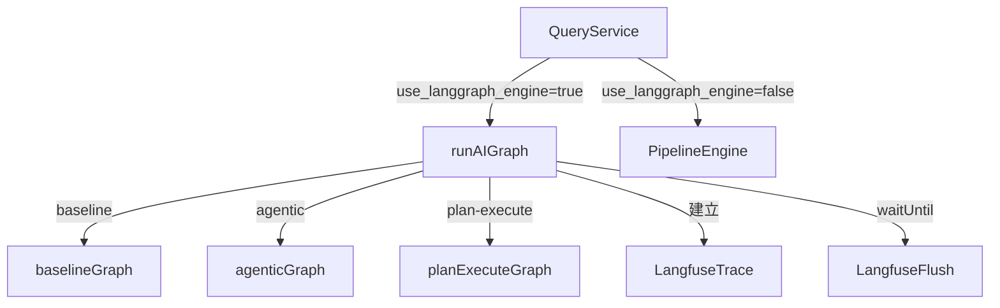
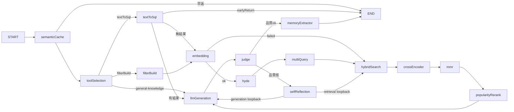
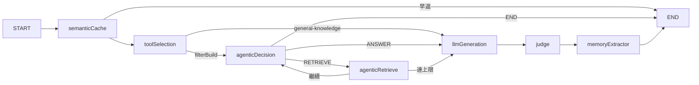
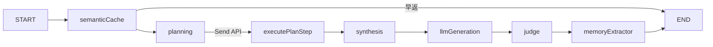

# LangGraph 架構文件

本文記錄 NobodyClimb AI 服務從自訂 Pipeline Engine 遷移至 LangGraph JS 的架構設計。

## 架構總覽



## Graph 策略對應

| `rag_strategy` | Graph | 適用場景 |
|---|---|---|
| `baseline`（預設）| `baselineGraph` | 一般 RAG 問答 |
| `agentic` | `agenticGraph` | 需要多輪推理的複雜查詢 |
| `plan-execute` | `planExecuteGraph` | 需要拆解為多個子查詢的問題 |

## Baseline RAG Graph



## Agentic ReAct Graph



## Plan-and-Execute Graph



`planning` 節點使用 LangGraph `Send` API 將各步驟以 map-reduce 方式並行執行。

## Node 對應原始 Pipeline Step

| LangGraph Node | 原始 Pipeline Step | 說明 |
|---|---|---|
| `semanticCache` | `SemanticCacheStep` | KV 語意快取 |
| `toolSelection` | `ToolSelectionStep` | LLM 分析查詢類型 |
| `filterBuild` | `FilterBuildStep` | 建構向量搜尋過濾器 |
| `textToSql` | `TextToSqlStep` | 自然語言轉 SQL |
| `embedding` | `EmbeddingStep` | 查詢向量化 |
| `hyde` | `HydeStep` | 假設文件生成 |
| `multiQuery` | `MultiQueryStep` | 多查詢展開 |
| `hybridSearch` | `HybridSearchStep` | BM25 + 向量混合搜尋 |
| `crossEncoder` | `CrossEncoderStep` | Cross-encoder 重排序 |
| `mmr` | `MmrStep` | 最大邊際相關性去重 |
| `popularityRerank` | `PopularityRerankStep` | 熱門度重排序 |
| `llmGeneration` | `LlmGenerationStep` | LLM 回答生成 |
| `judge` | `JudgeStep` | 回答品質評估 |
| `selfReflection` | `SelfReflectionStep` | 自我反思修正 |
| `memoryExtractor` | `MemoryExtractorStep` | 記憶抽取儲存 |
| `agenticDecision` | `AgenticDecisionStep` | ReAct 決策節點 |
| `agenticRetrieve` | `AgenticRetrieveStep` | ReAct 檢索節點 |
| `planning` | `PlanQueryStep` | 查詢拆解規劃 |
| `executePlanStep` | `ExecutePlanStepStep` | 單步驟執行 |
| `synthesis` | `SynthesizeStep` | 多步驟結果合成 |

## Feature Flag 切換方式

`use_langgraph_engine` 存於 `ai_config` 表（`PipelineConfig` 型別）：

```bash
# 啟用新引擎（本機）
curl -X POST http://localhost:8787/api/v1/admin/ai/config \
  -H "Authorization: Bearer <admin_token>" \
  -H "Content-Type: application/json" \
  -d '{"key": "use_langgraph_engine", "value": "true"}'

# 回退至原始引擎
curl -X POST http://localhost:8787/api/v1/admin/ai/config \
  -H "Authorization: Bearer <admin_token>" \
  -H "Content-Type: application/json" \
  -d '{"key": "use_langgraph_engine", "value": "false"}'
```

預設值為 `false`，不影響現有行為。

## Langfuse 可觀察性

每個請求在 `runAIGraph()` 建立一個頂層 trace：

- **Trace name**: `ai-pipeline`
- **Trace metadata**: `strategy`（baseline/agentic/plan-execute）
- **Trace input**: `query`
- **Trace output**: `answer`

各 node 使用 `startSpan()` / `endSpan()` 記錄 span。

**Langfuse Dashboard 觀察重點：**
- `ai-pipeline` trace 的總延遲
- `llmGeneration` span 的 token usage
- `judge` span 的品質分數（`output.quality`）
- `selfReflection` 是否觸發（loopback 次數）
- `agenticDecision` 的決策分布（RETRIEVE vs ANSWER）

**Langfuse 靜默降級**：若 `LANGFUSE_PUBLIC_KEY` / `LANGFUSE_SECRET_KEY` 未設定，所有 Langfuse 呼叫靜默忽略，AI 功能正常運作。

## 如何新增 Node

1. 在 `backend/src/services/ai-graph/nodes/` 建立新 node 檔案：

```typescript
import { GraphState } from '../state';
import { startSpan, endSpan } from '../langfuse';

export async function myNewNode(state: GraphState): Promise<Partial<GraphState>> {
  const span = startSpan(state.langfuseTrace ?? null, 'myNewNode', { input: state.request.query });
  try {
    // 實作邏輯
    const result = /* ... */;
    endSpan(span, { output: result });
    return { /* 更新的 state 欄位 */ };
  } catch (err) {
    endSpan(span, { level: 'ERROR', statusMessage: String(err) });
    throw err;
  }
}
```

2. 在對應 graph 檔案（`baseline.ts` / `agentic.ts` / `plan-execute.ts`）加入 `.addNode('myNew', myNewNode)`
3. 用 `.addEdge()` 或 `.addConditionalEdges()` 接線
4. 若需要 routing，在 `routing.ts` 新增對應函式並加入單元測試（`__tests__/routing.test.ts`）

## 如何修改 Routing

所有 routing 函式位於 `backend/src/services/ai-graph/routing.ts`：

```typescript
// 純函式，不呼叫外部 API，便於單元測試
export function routeAfterXxx(state: GraphState): 'nodeA' | 'nodeB' | typeof END {
  if (state.someField === 'condition') return 'nodeA';
  return 'nodeB';
}
```

修改後務必更新 `__tests__/routing.test.ts` 中的對應測試。

## GraphState 關鍵欄位

| 欄位 | 型別 | 說明 |
|---|---|---|
| `langfuseTrace` | `LangfuseTraceClient \| null` | 當前請求的 Langfuse trace |
| `agenticAction` | `'RETRIEVE' \| 'ANSWER' \| undefined` | Agentic 模式的決策結果 |
| `llmProvider` | `AIProvider \| undefined` | 當前 LLM provider 實例 |
| `embeddingProvider` | `AIProvider \| undefined` | 當前 Embedding provider 實例 |
| `degradedStages` | `string[] \| undefined` | 已降級的 stages（累積）|
| `trace` | `Record<string, unknown>` | 執行追蹤資訊（merge reducer）|
| `tokenBreakdown` | `Record<string, StageTokenUsage>` | 各 stage token 用量（merge reducer）|
